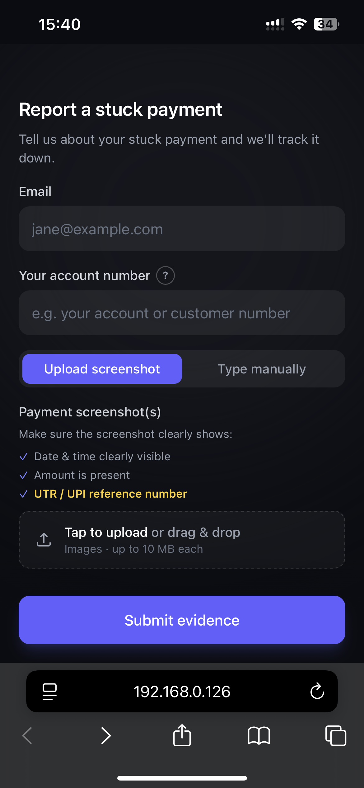
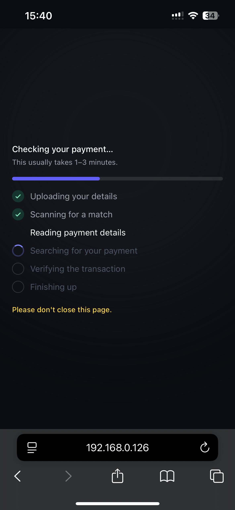
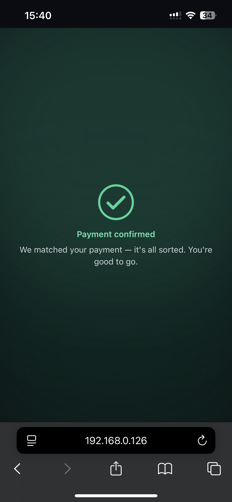
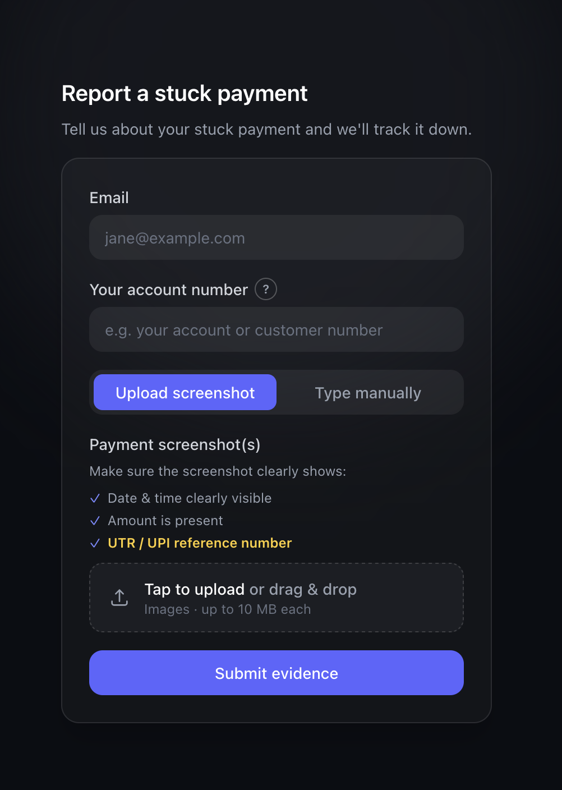
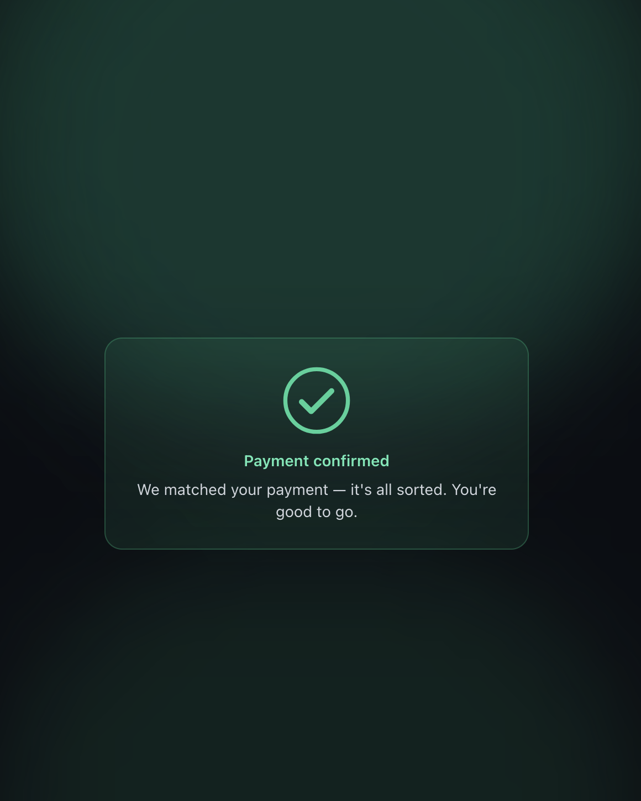

# UPI Stuck-Payment — Self-Service Resolution

## UI / UX

Mobile-first and edge-to-edge on phones; a focused, centered card on desktop.
Dark fintech theme, filled inputs, calm motion (phase cross-fades, a progress
stepper during the wait, and a celebratory success screen), and a touch-first
help system.

### On mobile (edge-to-edge)

<table>
  <tr>
    <td align="center"><br/><sub>Report form · upload screenshot</sub></td>
    <td align="center"><br/><sub>Progress while matching</sub></td>
    <td align="center"><br/><sub>Approved 🎉</sub></td>
  </tr>
</table>

### On desktop (centered card)

<table>
  <tr>
    <td align="center"><br/><sub>Report form</sub></td>
    <td align="center"><br/><sub>Approved</sub></td>
  </tr>
</table>

**UX highlights**

- **Two capture methods** with an animated tab switcher; mode-aware validation.
- **Progress stepper** during the (potentially multi-minute) match, so the wait
  feels intentional and the user knows not to close the page.
- **Edge-to-edge on mobile** with a sticky submit button in thumb reach; a
  contained card on desktop.
- **Success moment** — full-screen green wash, a checkmark that draws itself in,
  and a light confetti burst.
- **Accessible motion** — everything respects `prefers-reduced-motion`; help
  hints are tap-to-open (real tooltips don't work on touch).

---

## Flow

The client picks one of two ways to report (screenshot or manual), the
auto-matcher runs, and the next step depends on the result **and** which method
was used:

```text
                 Report a stuck payment
            ┌───────────────┴───────────────┐
            ▼                               ▼
    Upload a screenshot             Type the details in
            └───────────────┬───────────────┘
                            ▼
                       Auto-matcher
                            │
                            ├──►  MATCHED  ──►  ✓ Payment confirmed 🎉
                            │
                            └──►  NOT MATCHED
                                       │
        ┌──────────────────────────────┘
        │
        ├─  reported by screenshot
        │       • Upload a clearer screenshot   ──►  back to start
        │       • Switch to manual entry        ──►  back to start
        │
        └─  reported manually
                • Check & edit the details       ──►  back to start
                • Submit to our support team     ──►  🎫  Support ticket created
```

**In words:**

1. **Submit** a report — by **screenshot** or by **manual entry** (date & time,
   UTR / UPI reference, amount, optional notes).
2. The **auto-matcher** processes it (a slow step — the UI shows a progress
   stepper and asks the user not to close the page).
3. **Matched →** success screen. Done.
4. **Not matched, from a screenshot →** the image wasn't enough. The user can
   **upload a clearer screenshot** or **switch to manual entry**.
5. **Not matched, from manual entry →** the details didn't line up. The user can
   **fix the details and retry** or **submit to the support team**, which
   creates a ticket and emails them an update.

This guarantees there's **never a dead end** — every failure has a forward path.

---

## Business value

**Pros**

- **Drop-in integration** — merchant links with `email` + `merchant_client_id`
  prefilled (the id is hidden); often a one-tap report.
- **Two paths = higher completion** — manual entry recovers reports that a
  blurry/unreadable screenshot would otherwise lose.
- **Graceful escalation** — a support ticket is raised only after auto **and**
  manual both fail, so **support load stays** low and there's never a dead end.
- **No middleman** — client deals with the provider directly: faster, fewer hops.

**Limitations (V1)**

- Backend is **mocked** — no real OCR / matcher / ticketing yet.
- No post-submit status tracking (updates go by email).
- Link-based access, no auth — production needs signed / expiring links.
- No duplicate detection, no localization, client-side file checks only.

---

## Integration

The merchant deep-links into the page with query parameters. Nothing else is
required.

| Param | Purpose | Notes |
|-------|---------|-------|
| `email` | Prefills the email field | The address we email updates to |
| `merchant_client_id` | Prefills **and hides** the "Your account number" field | It's an internal id the user shouldn't see/edit. Alias: `mcid` |
| `mock` | Forces a demo outcome | `approved` · `unmatched` (alias `needs_evidence`) |

Example merchant link (client id is prefilled and hidden from the user):

```
https://your-host/?email=jane@example.com&merchant_client_id=USER-12345
```

### Example links

Open these against a running dev server (`npm run dev`):

| What | URL |
|------|-----|
| Default (random outcome) | http://localhost:5173/ |
| **Approved** (success screen) | http://localhost:5173/?mock=approved |
| **Unmatched** (retry / switch / escalate flows) | http://localhost:5173/?mock=unmatched |
| Prefilled email + client id (id hidden) | http://localhost:5173/?email=jane@example.com&merchant_client_id=USER-12345 |
| Full merchant link → approved | http://localhost:5173/?email=jane@example.com&merchant_client_id=USER-12345&mock=approved |

---

## Running & testing

```bash
npm install
```

### Desktop (local)

```bash
npm run dev
```

Open **http://localhost:5173**

### Real device on your network

```bash
npm run dev-host
```

Vite prints a **Network** URL (e.g. `http://192.168.1.42:5173`). Open that on a
phone connected to the **same Wi-Fi** to test the mobile layout, the sticky
submit, and the native datetime picker on a real device.

**Try the failure flows:** open `?mock=unmatched`, submit in **screenshot** mode
→ you'll be offered *upload again* / *switch to manual*. Submit in **manual**
mode → *edit details* / *submit to support* (which shows the ticket screen).

> The match takes ~10s (simulated) so you can watch the progress stepper; the
> ticket step ~2.5s. Both are constants in `src/lib/api.ts`.
